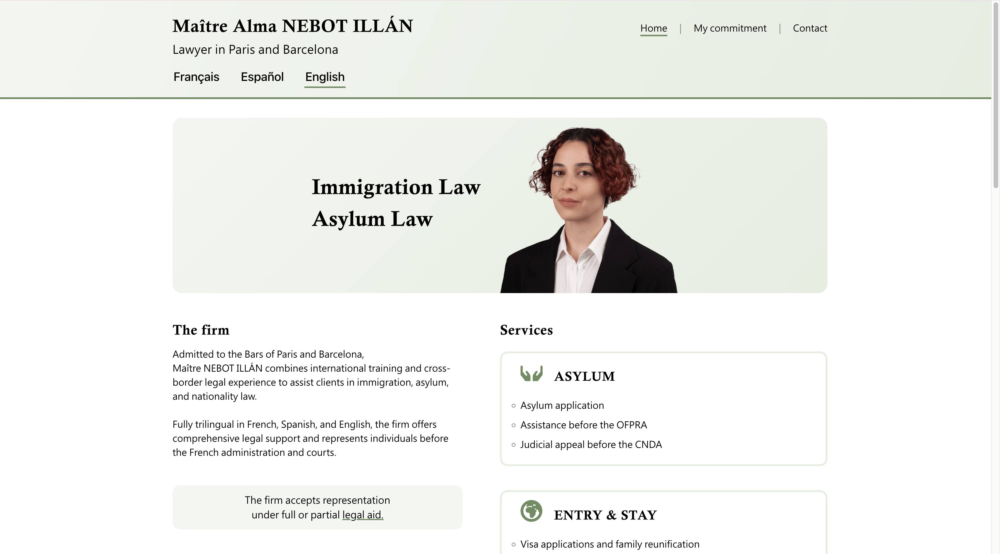

# Comercial website for Maître NEBOT ILLÁN,<br>Lawyer in Paris and Barcelona


## Multi-languages

This project brought me the opportunity of translating a multi-languages website in three of the four languages I use on a daily basis.<br>
The `t9n.js` file contains some commented-out snippets that I might use to group every translation in one unique object. But for SEO related reasons I purposely chose to use three html files instead. Though this way does not offer the sleekest navigating experience, the commercial impact of an **international oriented SEO was the best option for my customer's interests**, which always come first.

## Minimalist design and extreme accessibility

Unconcerned by sophisticated designs, the instructions of my customer were to achieve a very simple refined document-like presentation of her services, with **as few navigation menus as possible**, so that a non french language user could directly identify their **language option** without having to search for it through any kind of dropdown menu, taking into account that some users might have been going through a very hard and precarious road.<br>
Also the easy acces for persons unused to navigate through menus was a big priority.<br>
<br>
<br>
<br>
<br>
<br>


```
Developped by:
https://github.com/noemirtil  _      _   _ _
   _ __   ___   ___ _ __ ___ (_)_ __| |_(_) |
  | '_ \ / _ \ / _ \ '_ ' _ \| | '__| __| | |
  | | | | (_) |  __/ | | | | | | |  | |_| | |
  |_| |_|\___/ \___|_| |_| |_|_|_|   \__|_|_|
```
###[noemirtil](https://github.com/noemirtil)